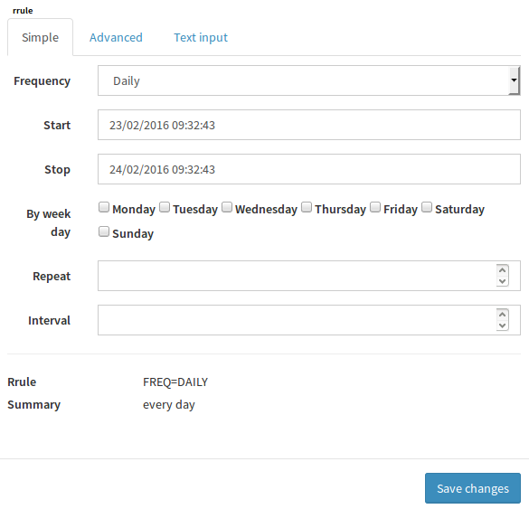
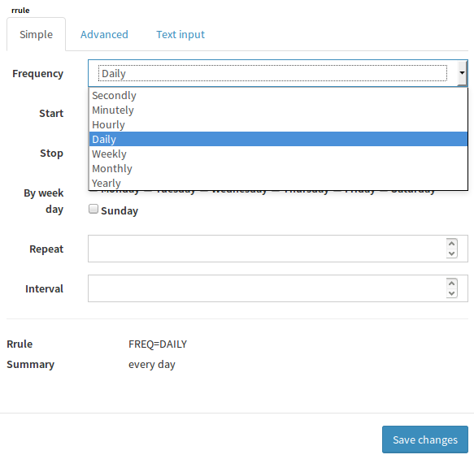
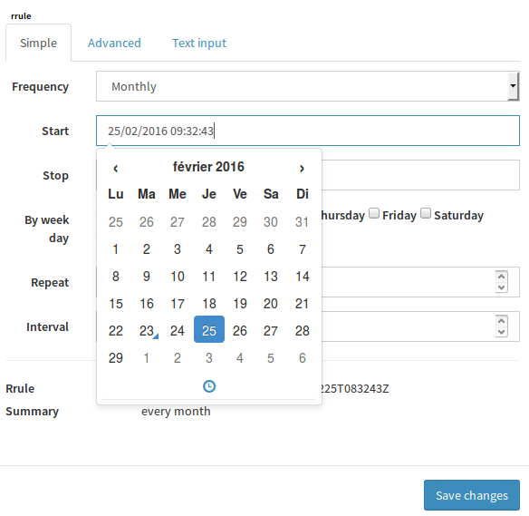
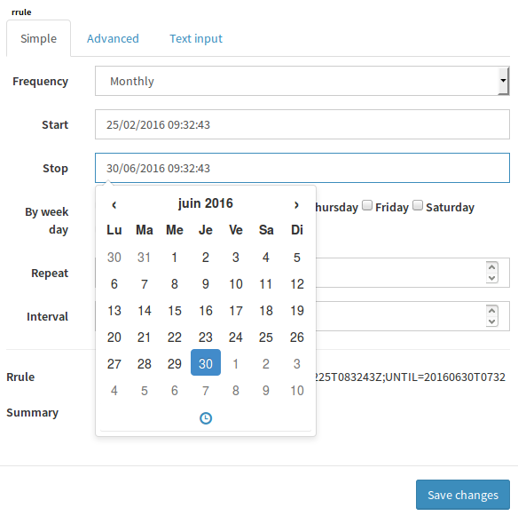
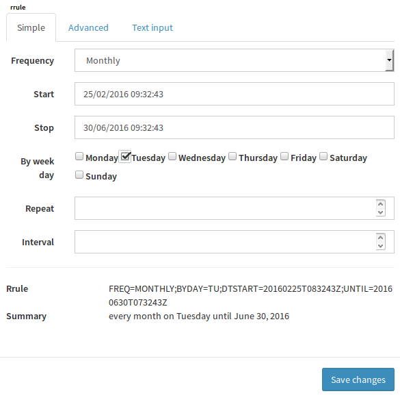
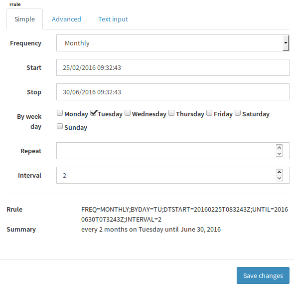
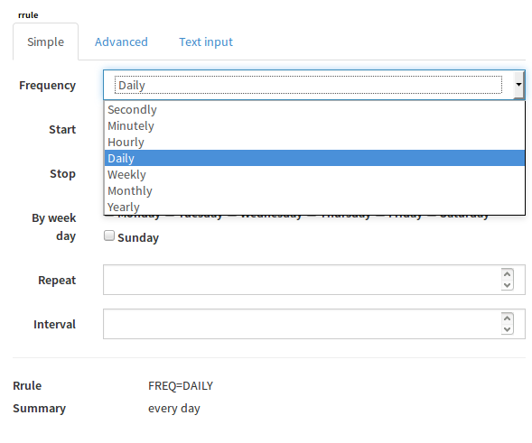
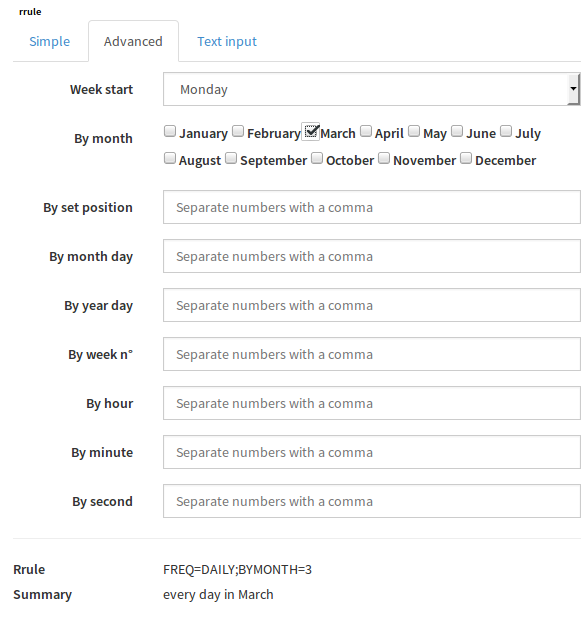
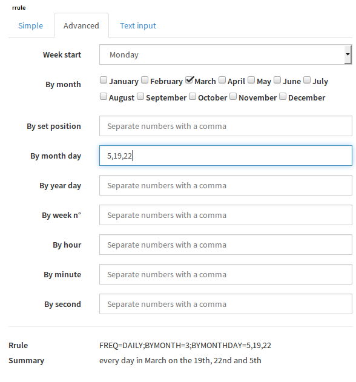
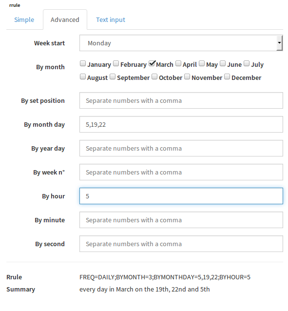

.. _tr__rruleEditor:

=====================
Canopsis rrule editor
=====================

This document describes how to use the rrule editor feature.

.. contents::
   :depth: 2

References
==========

List of referenced functional and technical requirements...

- `fr__rruleEditor.rst <../FR/fr__rruleEditor.rst>`_
- `tr__rruleEditor.rst <../TR/tr__rruleEditor.rst>`_

Updates
=======

.. csv-table::
   :header: "Author(s)", "Date", "Version", "Summary", "Accepted by"

   "Tristan Carranante", "2016/02/26", "0.1", "Step by step tutorial",""
   "Tristan Carranante", "2016/02/16", "0.1", "Creation","Florent Demeulenaere"

Contents
========

.. _ED__Title__Desc:

Installation
------------

Brick installation
~~~~~~~~~~~~~~~~~~

To install the calendar brick in Canopsis, please follow the README instruction `here <https://git.canopsis.net/canopsis-ui-bricks/brick-rrule-editor#installation>`_

After installation the easiest way to test the editor is to go in the ui and settings -> User interface -> Editors, type "rrule" in the left text box and rruleeditor in the right one, hit the plus button and save changes.

Now if you go in the Engines -> Scheduled jobs, click the edit button of the default task tasklinklist, you can see the rrule editor on the second panel in the tab "link list". 

Brick Use
~~~~~~~~~~~~~~~~

The value shown in the editor bottom is the value that will be save when you save the form. If the human rrule field says that your rule makes no sens , this will not prevent you to save but be warned that your rrule will not be applied by canopsis, it's your responsability to provide options that make sens.

Every field has an embedded tooltip, feel free to hover it if you don't understand what an option do.

Simple rule case
~~~~~~~~~~~~~~~~

For a simple rule you only need the first editor tab. We will create the following rrule : "Every 2 Months on Tuesday until June30, 2016", today we are the 23 feb 2016.
  
- First you must choose the frequency:
  

- Then choose a start date:

- The stop date:

- The choose the right day, tuesday:

- Choose the interval, every two occurence:

- Click save and you're good.

Complex rule case
~~~~~~~~~~~~~~~~~

For a complex rule you need the two first tabs. With the second tab you will be able to exclude dates and occurences based on some options, ex: first day of the month. In the exemple we will create the following rule "every day in March on the 19th, 22nd and 5th at 5am".

- First choose the daily frequency

- Then on the "advanced" tab you click on the march button for the "by month" value. If you want to add another month to the rrule just click the one you want.

- For the "by month day" type every day number where you want the rrule to apply

- Finally type the hour number 5 in the "by hour" field.
  

- Click on the save button 

Hand written rule case
~~~~~~~~~~~~~~~~~~~~~~

You can write your own rule in the third tab.

The brick works for both creating and editing a rrule.

