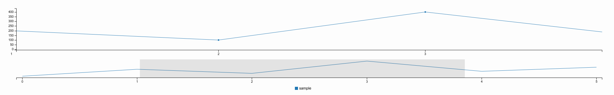

.. _FR__Time_chart:

==========
Time chart
==========

The timechart widget in canopsis UI allow display of metric values over time.

.. contents::
   :depth: 4

----------
References
----------

-------
Updates
-------

.. csv-table::
   :header: "Author(s)", "Date", "Version", "Summary", "Accepted by"

   "Florent Demeulenaere", "2016/01/19", "1.4", "Re-organisation and take account of remarks"
   "Florent Demeulenaere", "2016/01/19", "1.3", "parameters", ""
   "Florent Demeulenaere", "2016/01/19", "1.2", "widget duplicity", ""
   "Florent Demeulenaere", "2016/01/18", "1.1", "data sources", ""
   "Eric Régnier", "2015/10/22", "1.0", "Spec creation", ""

--------
Contents
--------

.. _FR__Title__Desc:

Description
-----------

This widget fetch data (metrics, events log, pbehaviors) from the backend depending on it's configuration. This allows metric display over time that comes with many features and options described below.

Features
--------

Data sources
~~~~~~~~~~~~

The timechart widget is able to display data from 3 different sources described below:

Show events log
<<<<<<<<<<<<<<<

The chart has to be able to show events log. The events log information comes with the ``custom filter`` system that will allow the user to generate custom filters for ``specific event log selection``. Events log once fetched will be displayed on the chart and their information have to be reachable (redirection to history view by click on one of them).

Events log can , for example, be displayed with specific bars with events_log count in the related timewindow on top of them:

Display pbehaviors
<<<<<<<<<<<<<<<<<<

Downtime periods are displayed as ``coloured background intervals`` on the chart. Downtime displayed on the graph are linked to the displayed metrics. Downtime periods are fetched from api and then displayed on the chart and the history chart:

Shown pbehaviors are link to the displayed metrics. Different pbehaviors are recognizable thanks to a color code.

Display perfdata
<<<<<<<<<<<<<<<<

Perfdata (or metrics) are fetched by selecting entities (resource - component - name) in the configuration of the widget. Perfdata are sets of points, so the widget can display points, curves, area charts, stacked charts, bar charts, point charts...:

Widget Duplicity
~~~~~~~~~~~~~~~~

The timechart widget can be created one by one, or several in the same time.
The timechart editor have to give several possibilites to create charts and group metrics into them.

First, if you want to only create one graph:

all selected metrics are displayed in the graph.

Secondly, if you want to specify the display for each graph:

Here you can customize each created graph

Finally, if you want to create graphs dynamically:

If group by is checked, you can display metrics group by the chosen option.
If group by is not checked, one chart is created for each metric.

Basic features
~~~~~~~~~~~~~~

Custom curves
<<<<<<<<<<<<<

For each selected metric, the user can:

- put a label (handlebars compliant)
- link to a color
- put one or several threshold
- define the curve type (aera, line, etc.)

These parameters could be set in the chart configuration. If nothing is enquired, default values are considered.

Human readables values
<<<<<<<<<<<<<<<<<<<<<<

All Data measurement that can be displayed into the widget have to be optionnaly human readable. This means that numeric values have to be transformed to display the user values that are more understandable.

Displayed data have to be shorter (1 000 000 Mo can be written 1 To).
Data can also be rounded (1.006 seconds can be written 1 second).

These values are often contained in perfdata metadata.

Timewindow
<<<<<<<<<<

The user configuring a timechart widget have to be able to choose a timewindow within data are fetched. This timewindow will tell the widget to fetch data.

Zoom
<<<<

Zoom feature enable the widget to be clickable (drag and drop) in order to ``display a subset period of the widget configured timewindow``. When the action of zoom is triggered, the widget will focus the main chart display on the date interval ``from start date to stop date`` defined by the interactive ``information gathered on drag and drop user action``. This feature is available by default.

History view
<<<<<<<<<<<<

History view is an ``embeded chart at the bottom of the main chart`` displaying the same metric information but with a timewindow that does not vary when the main chart is zoomed. This feature is optional depending on widget configuration available.

Ergonomics features
~~~~~~~~~~~~~~~~~~~

Additional axe Y
<<<<<<<<<<<<<<<<

Allow display data series within different axes Y. This feature ``allows to compare many data series``. The widget configuration will have an editor that enable series to axes mapping.

Additionals axes have to be in the same color that the relative curve.

Customizable labels
<<<<<<<<<<<<<<<<<<<

On the tooltip, in the legend and on axes, labels have to be editable. This is done thanks to an ``handlebars template`` that will describe how to compute labels from the metric informations. metric labels are computed by default with the metric name.

Tooltip et shared tooltip
<<<<<<<<<<<<<<<<<<<<<<<<<

You can display a tooltip for each point on the chart that will display the ``value on a popover`` element on the chart. The shared version will show all metrics data that exists at the same X axis point.

Legend
<<<<<<

The graph legend position has to be editable in the widget configuration.

Exports
<<<<<<<

Graphs have to be exportable in many formats (PDF, PNG, JPEG, CSV). The widget will have an export button which let the user choose the export.

Timewindow offset
<<<<<<<<<<<<<<<<<

Tells the widget to move the ``to`` value of the data period selection of the offset value in the past. This leads to a time shift.

Calculation and comparison features
~~~~~~~~~~~~~~~~~~~~~~~~~~~~~~~~~~~

Threshold
<<<<<<<<<

Defining a threshold value will display on the chart a line in the ``Y axis``. This helps to get better understanding of metric values over time. Thresholds can be ``minor, major critical`` for example.

Baselines
<<<<<<<<<

The timechart let the user display baselines. In the widget configuration, we can set:

- a metric
- a period
- a occurence number
- a comparison threshold

With these information, the graph will display the original curve (related to the metric) and previous curves in the same period.

Forecast
<<<<<<<<

The timechart let the user display forecast. To do that, we can set several parameters:

- a metric
- a time interval in which the widget takes perfada to take into account in order to project
- an ending date for the projection
- a projection algorithm
- one or several alert threshold relative to the prediction curve
- one or several constant threshold relative to the origine

Alarms could be created if curves exceed the thresholds compared to the calculated predicted curves.

Trend curves
<<<<<<<<<<<<

This widget has to display trends curves. Trends curves are easy to read because it is like a smooth version of the original curve. To do that, the widget doesn't take into account extrem data in order to redraw a pretty curve. This curve can give easily the trend and let the user quickly knows how the curve is evolving.

Functional tests
----------------

TODO
