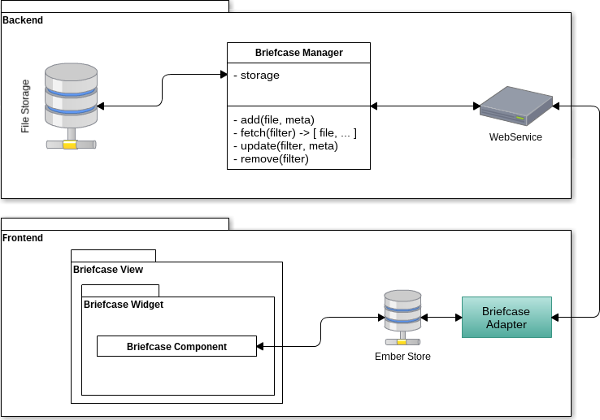
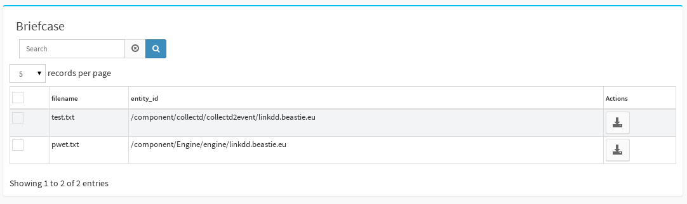

.. _TR__Briefcase:

=========
Briefcase
=========

This document describes the API provided by each parts of the Briefcase functionality.

.. contents::
   :depth: 2

References
==========

List of referenced functional and technical requirements...

- :ref:`FR::Briefcase <FR__Briefcase>`
- :ref:`FR::Widget <FR__Widget>`

Updates
=======

.. csv-table::
   :header: "Author(s)", "Date", "Version", "Summary", "Accepted by"

   "David Delassus", "2015/10/01", "0.4", "Add mixin informations", "Eric Regnier"
   "David Delassus", "2015/09/29", "0.3", "Add metadata informations", "Eric Regnier"
   "David Delassus", "2015/09/28", "0.2", "Add tests", ""
   "David Delassus", "2015/09/16", "0.1", "Document creation", ""

Contents
========

.. _TR__Briefcase__schema:

Briefcase data-flow through API
-------------------------------

**NB:** The *frontend* package is not yet available and is replaced by a simple list with the :ref:`mixin <FR__Widget__mixin>` ``briefcase``.

Briefcase metadata
------------------

Metadata is provided to the frontend to display in a list, or a specific widget.

They are described by the schema ``crecord.file`` available at: ``~canopsis/etc/schema.d/crecord.file.json``.

You should find the following fields:

 - ``filename``: holding the file's name
 - ``entity_id``: holding the ID of the file owner entity

Unit tests
==========

Case: adding a file
-------------------

.. code-block::

   add(entity_id, f, [name]) -> name

With:

 * ``entity_id`` as **str**, ie: ``'/fake/entity/id'``
 * ``f`` as **fileobj**, ie: ``StringIO('some content')`` or ``open('local_file.txt')``
 * optional ``name`` as **str** or **None**, ie: ``'test.txt'``
 * returned ``name``, if not specified, is an UUID, ie: ``'bd8078f3-f107-4004-a7e8-d9d934213728'``

Case: find files
----------------

.. code-block::

   fetch([entity_ids], [meta]) -> [(file, meta), ...]

With:

 * optional ``entity_ids`` as **str** or **list**, ie: ``['/fake/entity/id', '/fake/other_entity/id']``
 * optional ``meta`` as **dict**, ie: ``{'foo': 'bar'}``
 * returned list of:
    * ``file`` as **FileStream**
    * ``meta`` as **dict**

Case: updating a file
---------------------

.. code-block::

   update(name, [f], [entity_id], [meta])

With:

 * ``name`` as **str**, ie: ``'test.txt'``
 * optional ``f`` as **fileobj**, ie: ``StringIO('new content')`` or ``open('local_file2.txt')``
 * optional ``entity_id`` as **str**, ie: ``'/fake/other_entity/id'``
 * optional ``meta`` as **dict**, ie: ``{'foo': 'bar'}``

Case: removing
--------------

.. code-block::

   remove([names], [entity_ids], [meta])

With:

 * ``names`` as **str** or **list**, ie: ``['test.txt', 'test2.txt']``
 * ``entity_ids`` as **str** or **list**, ie: ``['/fake/entity/id', '/fake/other_entity/id']``
 * ``meta`` as **dict**, ie: ``{'foo': 'bar'}``

Functional tests
================

Configuring
-----------

Adding the record type ``file`` to the widget list's schema **SHOULD** make briefcase
metadata available in the widget list.

Downloading
-----------

If you have 2 files in the Briefcase:
 
 * ``test.txt`` associated to entity ``/component/collectd/collectd2event/linkdd.beastie.eu``
 * ``pwet.txt`` associated to entity ``/component/Engine/engine/linkdd.beastie.eu``

You should see the following:

By clicking on the action button ``Download``, you **SHOULD** be able to save the file to your computer, and see it in your file explorer.